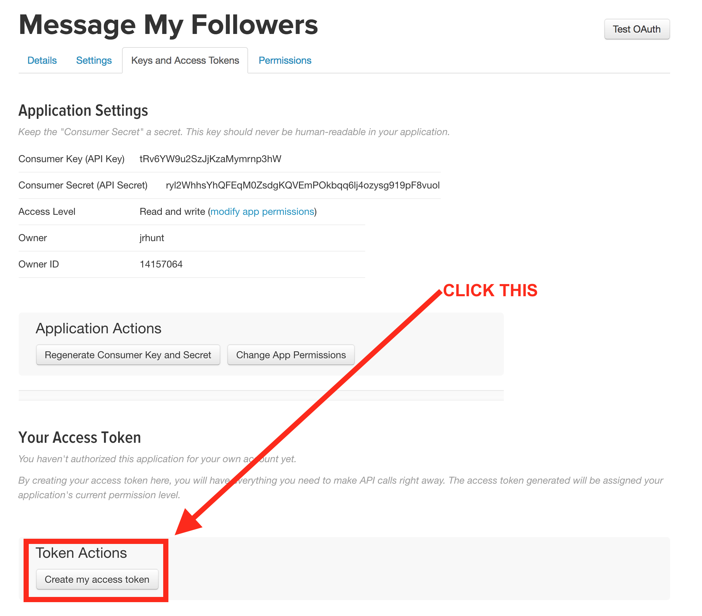
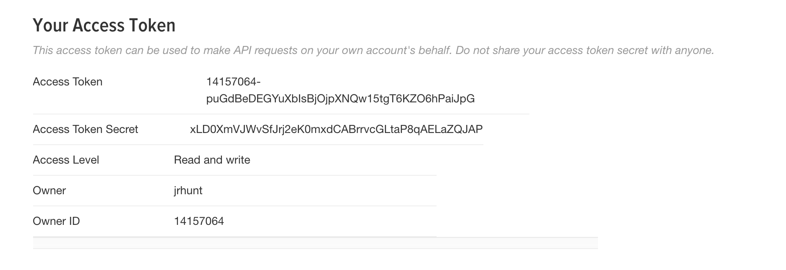
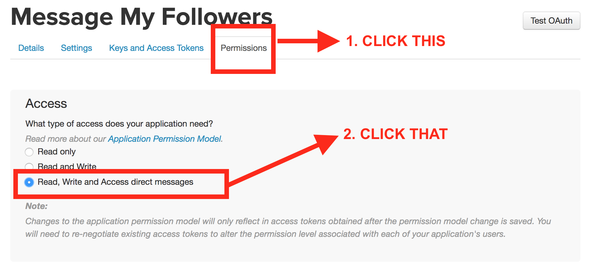

# Launch Stack

# Building a Twitter Auto Responder using AWS Lambda

One of the best ways for me to engage with customers is through twitter. I can answer a lot of trivial questions in DM without having to create a support ticket or involving account managers. The problem is that most people don't know that they can DM me. Having something that shoots out a DM with some basic info and my email address when I get a new twitter follower has been surprisingly powerful for engaging new AWS users. Previously I used a service called crowdfire to do this and it worked really well! I recommend them. I realized however, that I could write essentially the same service and run it for microcents a month... So, that's what I did. Here's how you can set this up on your own!

## Setting up a Twitter App
1. First we need to create a new twitter app by navigating to: [https://apps.twitter.com/](https://apps.twitter.com/)

2. Next we will create a new twitter application

3. Now we'll fill out some info to create that application

4. Next we'll generate some additional credentials for accessing our application as ourselves:

5. Then we'll save all this info somewhere safe!

6. Finally we'll update some of our application permissions so we can send direct messages:

## Setting up AWS Lambda
To setup the lambda function we can either use the launch stack button or we can simply upload this template.yaml in the cloudformation console file and have it set everything up for us!

### Run the template.yaml in cloudformation

## Further Work
Obviously there are issues around rate limiting to solve and I can think of a few ways to expand on those:
1. Use an SQS queue and have a lambda that reschedules itself with exponential backoff for rate limiting during periods where you get a large number of followers in a short period of time.
1. For people with 21600+ (60 minutes * 24 hours * 15 messages per minute rate limit) new followers a day you need a way to qualify potential leads before messaging them. (I don't have this problem)
1. Hit up the folks at twitter and find out if they have any suggestions.

A few other opportunities that I'd love to pursue are making this it's own service like crowdfire and adding intelligence to the responses.
On the DynamoDB side the initial follower load can take some time unless you initially scale up for a large number of writes. There's also the storage issue -- currently we index on follower_id but we would need to switch to user_id or have a table for each user. That doesn't scale as well and we might want to pursue an RDS solution instead so we can have a follower_user table. Other than that the entire service would scale easily to multiple users.

Longterm, I want to incorporate the FAQ for every AWS service into an ELK cluster and then use something like amazon lex to communicate intelligently with people asking straightforward questions.
